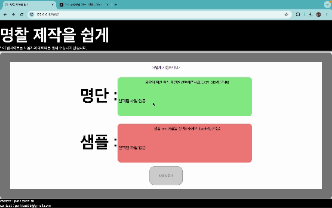

# xlsx-pptx-name-tag
수련회때 명찰 하나 하나 만드는 이선민 을장을 위한 프로그램
> 선민아 이제 이름표 하나 하나 만들지 말고 내가 만든 이 서비스를 이용해 정말 사용하기 쉬워
~~UI가 구려서 그렇지...~~
--------

-----

### 파일 구조
```
├── cloudtype/    
│   └── app.yml # 클라우드 타입 배포용    
├── files/    
├── main.py # fastapi    
├── nameplate.py # 이름표 제작용 파일     
├── requirements.txt # dependency    
├── templates/    
│   ├── help.html # 도움 페이지    
│   ├── home.html # 홈페이지     
│   └── index.html # 기본 템플릿     
```